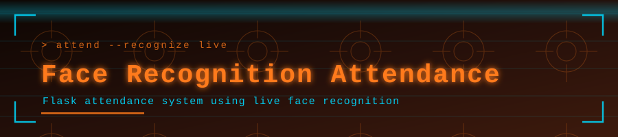

<p align="center">
  
</p>

<p align="center">
  
</p>

<p align="center">
  <a href="https://github.com/muqeetahmaad9/Face-Recognition-Attendance/stargazers"></a>
  <a href="https://github.com/muqeetahmaad9/Face-Recognition-Attendance/commits"></a>
  
</p>

---

### 📖 Overview

Marks attendance automatically from a webcam feed using face recognition, logging each recognised person to CSV through a Flask web interface.

### ✨ Features

- Live webcam recognition against a known-faces folder
- Automatic CSV attendance log with timestamps
- Flask web interface with streaming video

### 🧰 Built With

<p align="left">
  
</p>

### 🚀 Getting Started

```bash
pip install flask opencv-python face_recognition numpy
python app.py
```

### 👤 Author

**Muqeet Ahmad** — AI/ML Engineer · IoT & Embedded Systems Builder

<p align="left">
  <a href="https://www.linkedin.com/in/muqeet--ahmad/"></a>
  <a href="https://muqeetahmaad-portfolio.netlify.app/"></a>
  <a href="mailto:muqeetahmad155@gmail.com"></a>
</p>

<p align="center">
  
</p>
